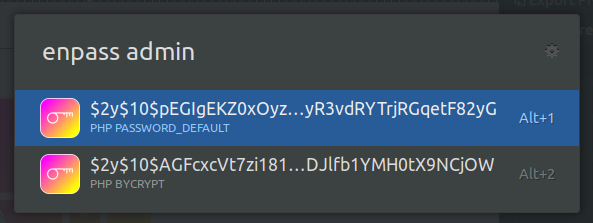

# Ulaucher Enpass

> [ulauncher](https://ulauncher.io/) Extension for encrypting string to hashed password (PHP PASSWORD_DEFAULT, PHP PASSWORD_BYCRYPT)

## Screenshots


## Requirements

* [ulauncher](https://ulauncher.io/)
* Python >= 2.7

## Install

Open ulauncher preferences window -> extensions -> add extension and paste the following url:

```https://github.com/fsevenm/ulauncher-enpass```
 

## Development

```
git clone https://github.com/fsevenm/ulauncher-enpass
cd ~/.cache/ulauncher_cache/extensions/ulauncher-enpass
ln -s <repo_location> ulauncher-enpass
```

To see your changes, stop ulauncher and run it from the command line with: ```ulauncher -v```.

## License 

MIT
